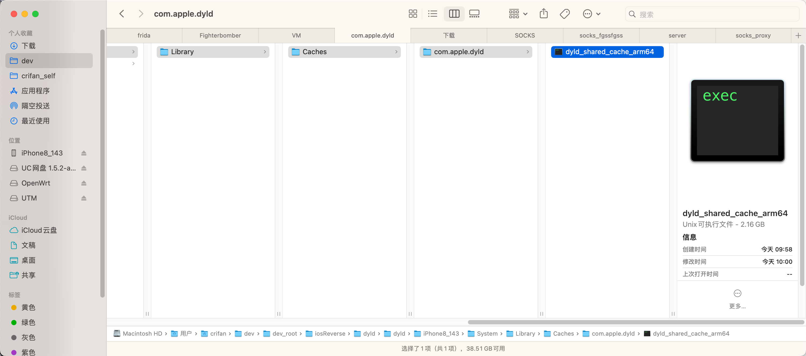

# dyld_shared_cache_arm64

dyld的shared cache的最典型文件名就是：arm64版本的：

* `dyld_shared_cache_arm64`
  * 位置：`/System/Library/Caches/com.apple.dyld/dyld_shared_cache_arm64`
  * 大小：约`2GB`
  * 举例
    * `iOS 14.3`的`iPhone8`中的`dyld_shared_cache_arm64`
      ```bash
      iPhone8-143:~ root# ls -lh /System/Library/Caches/com.apple.
      com.apple.dyld/         com.apple.factorydata/  com.apple.kernelcaches/
      iPhone8-143:~ root# ls -lh /System/Library/Caches/com.apple.dyld/dyld_shared_cache_arm64
      -rwxr-xr-x 1 root admin 2.1G Dec  8  2020 /System/Library/Caches/com.apple.dyld/dyld_shared_cache_arm64*

      iPhone8-143:~ root# ls -lh /System/Library/Caches/com.apple.dyld/
      total 2.1G
      -rwxr-xr-x 1 root admin 2.1G Dec  8  2020 dyld_shared_cache_arm64*
      ```
    * 导出到Mac
      ```bash
      ➜  ~ scp root@192.168.2.27:/System/Library/Caches/com.apple.dyld/dyld_shared_cache_arm64 /Users/crifan/dev/dev_root/iosReverse/dyld/dyld/iPhone8_143/System/Library/Caches/com.apple.dyld
      dyld_shared_cache_arm64                                                                                                                    100% 2059MB  18.8MB/s   01:49
      ```
    * 后的效果
      * 
