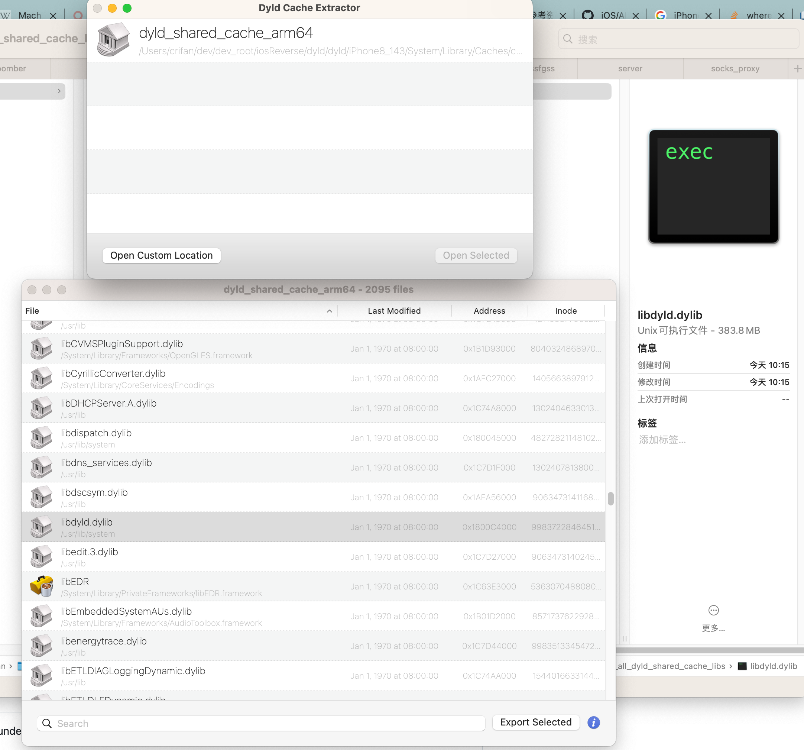
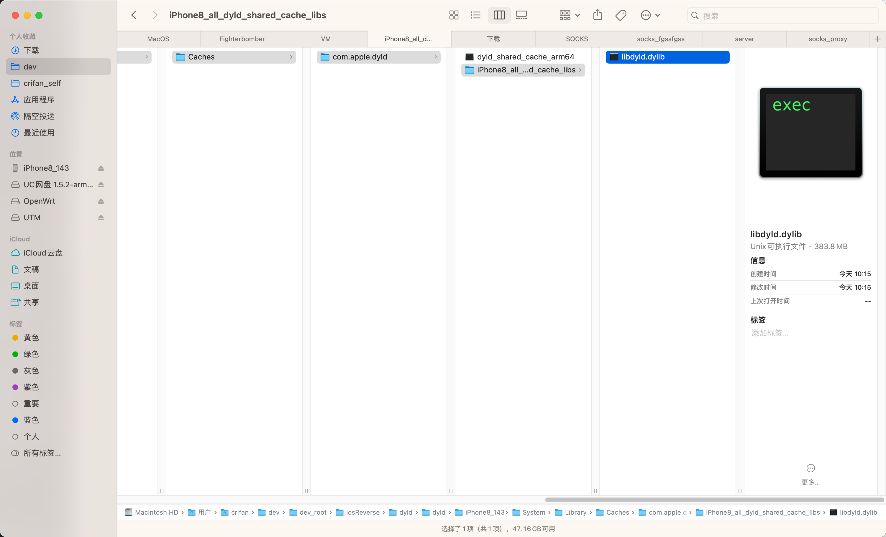
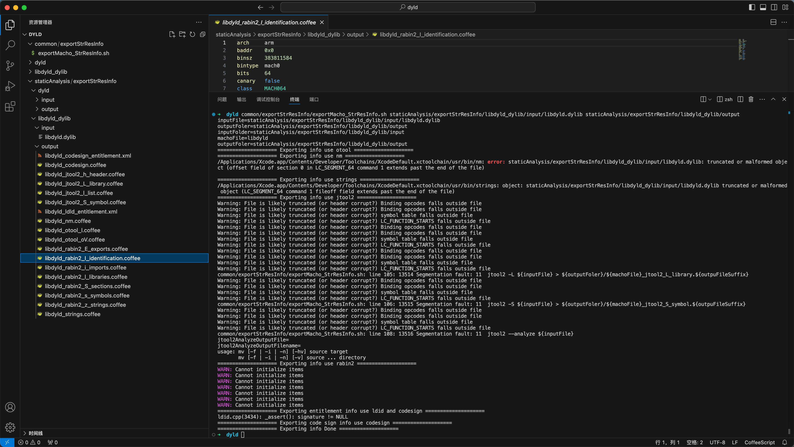
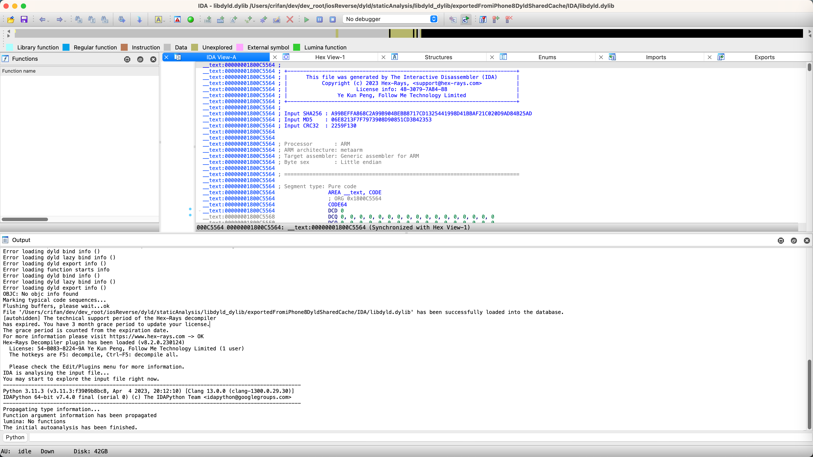
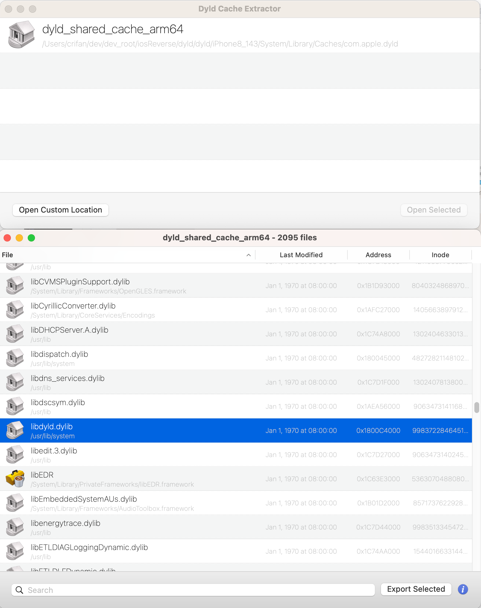

# dyld_cache_extract

* `dyld_cache_extract`
  * 评价：**界面不错，但导出库有问题，无法正常使用**
    * 导出单个库`libdyld.dylib`的大小异常：应该是`300KB`+，但是却是异常大的`300MB`+
      * 原因：内部应该是别人提到的，没有去除掉公共的header等部分而导致体积异常大
      * 效果：
        * 
        * 
      * 从而后续用工具分析和导出资源会报错
        * 导出静态资源出错
          * 
        * IDA分析出错
          * 
  * 作用：可视化的工具，把dyld_shared_cache载入即可解析出来
  * Github
    * https://github.com/macmade/dyld_cache_extract
  * 界面
    * 
