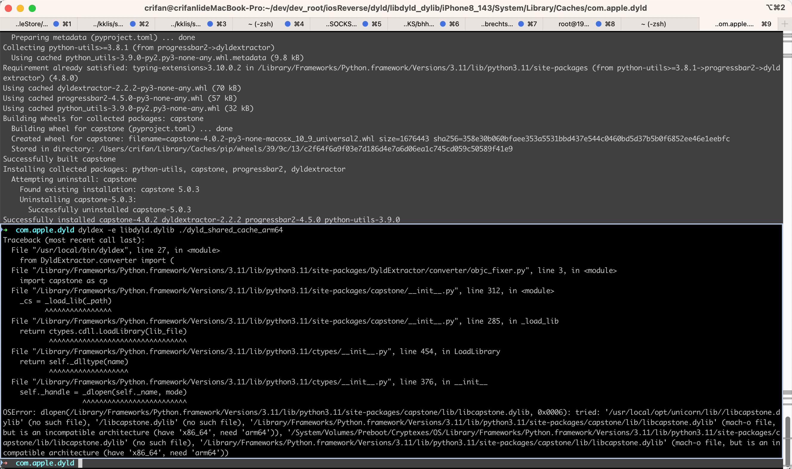

# DyldExtractor相关心得

## OSError dlopen mach-o file, but is an incompatible architecture (have 'x86_64', need 'arm64')

此处：

```bash
dyldex -e libdyld.dylib ./dyld_shared_cache_arm64
```

报错：

```bash
➜  com.apple.dyld dyldex -e libdyld.dylib ./dyld_shared_cache_arm64
Traceback (most recent call last):
  File "/usr/local/bin/dyldex", line 27, in <module>
    from DyldExtractor.converter import (
  File "/Library/Frameworks/Python.framework/Versions/3.11/lib/python3.11/site-packages/DyldExtractor/converter/objc_fixer.py", line 3, in <module>
    import capstone as cp
  File "/Library/Frameworks/Python.framework/Versions/3.11/lib/python3.11/site-packages/capstone/__init__.py", line 312, in <module>
    _cs = _load_lib(_path)
          ^^^^^^^^^^^^^^^^
  File "/Library/Frameworks/Python.framework/Versions/3.11/lib/python3.11/site-packages/capstone/__init__.py", line 285, in _load_lib
    return ctypes.cdll.LoadLibrary(lib_file)
           ^^^^^^^^^^^^^^^^^^^^^^^^^^^^^^^^^
  File "/Library/Frameworks/Python.framework/Versions/3.11/lib/python3.11/ctypes/__init__.py", line 454, in LoadLibrary
    return self._dlltype(name)
           ^^^^^^^^^^^^^^^^^^^
  File "/Library/Frameworks/Python.framework/Versions/3.11/lib/python3.11/ctypes/__init__.py", line 376, in __init__
    self._handle = _dlopen(self._name, mode)
                   ^^^^^^^^^^^^^^^^^^^^^^^^^
OSError: dlopen(/Library/Frameworks/Python.framework/Versions/3.11/lib/python3.11/site-packages/capstone/lib/libcapstone.dylib, 0x0006): tried: '/usr/local/opt/unicorn/lib//libcapstone.dylib' (no such file), '/libcapstone.dylib' (no such file), '/Library/Frameworks/Python.framework/Versions/3.11/lib/python3.11/site-packages/capstone/lib/libcapstone.dylib' (mach-o file, but is an incompatible architecture (have 'x86_64', need 'arm64')), '/System/Volumes/Preboot/Cryptexes/OS/Library/Frameworks/Python.framework/Versions/3.11/lib/python3.11/site-packages/capstone/lib/libcapstone.dylib' (no such file), '/Library/Frameworks/Python.framework/Versions/3.11/lib/python3.11/site-packages/capstone/lib/libcapstone.dylib' (mach-o file, but is an incompatible architecture (have 'x86_64', need 'arm64'))
```



原因：

此处所依赖的`capstone`的lib：

但是架构不匹配：

* `/Library/Frameworks/Python.framework/Versions/3.11/lib/python3.11/site-packages/capstone/lib/libcapstone.dylib`
  * 实际是：`x86_64`
    * 希望是：`arm64`

解决办法：

想办法，重新安装个`arm64`的`capstone`，对应lib就是arm64的了

具体步骤：

（1）卸载之前的

```bash
python3.11 -m pip uninstall capstone
```

（2）重新安装新的arm64的

```bash
arch -arm64 python3.11 -m pip install capstone
```

即可。

## ModuleNotFoundError No module named distutils

运行：

```bash
dyldex -e libdyld.dylib ./dyld_shared_cache_arm64
```

报错：

```bash
  File "/usr/local/bin/dyldex", line 25, in <module>
    from DyldExtractor.converter import (
    ...<5 lines>...
    )
  File "/usr/local/lib/python3.13/site-packages/DyldExtractor/converter/objc_fixer.py", line 3, in <module>
    import capstone as cp
  File "/usr/local/lib/python3.13/site-packages/capstone/__init__.py", line 266, in <module>
    import distutils.sysconfig
ModuleNotFoundError: No module named 'distutils'
```

原因：

此次所用的Python是，最新版:`Python 3.13`

而`Python 3.12`之后，就移除了库：`distutils`，从而导致此处找不到库

解决办法：

有2种思路：

* 改脚本（`/usr/local/bin/dyldex`）代码
* 换旧版本Python

此处用第二种：换旧版本Python

此处另外已安装了旧版本`Python 3.11`

继续去：

重新给此处已有的Python3.11安装库：

```bash
python3.11 -m pip install dyldextractor
```

然后告诉脚本用此特定的版本`Python 3.11`

需要改动脚本：

* `/usr/local/bin/dyldex`

```shell
#!/usr/local/bin/python3.11

# old: !/usr/local/opt/python@3.13/bin/python3.13

import progressbar
...
```
