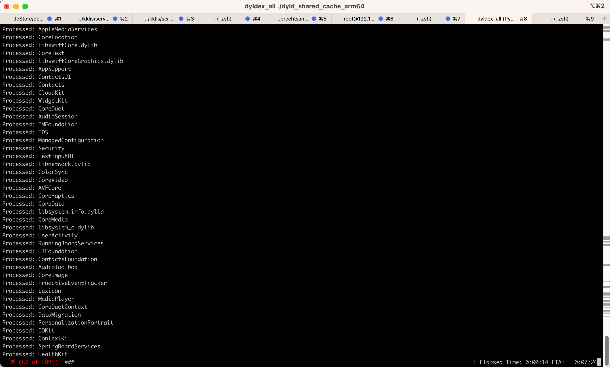
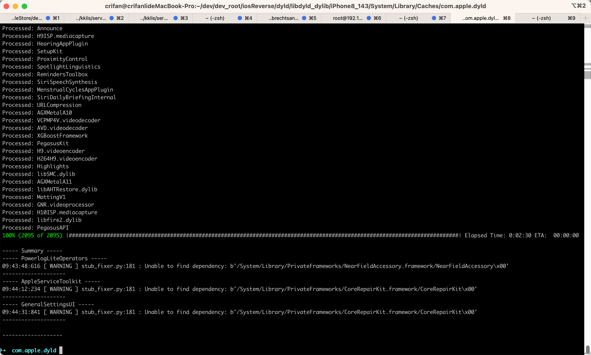

# 过程





* 日志

```bash
➜  com.apple.dyld dyldex_all ./dyld_shared_cache_arm64
Processed: libdyld.dylib
Processed: SystemConfiguration
Processed: libicucore.A.dylib
Processed: libCGInterfaces.dylib
Processed: WirelessDiagnostics
Processed: libdispatch.dylib
Processed: libAccessibility.dylib
Processed: Accounts
Processed: BackBoardServices
Processed: CoreTelephony
Processed: TextInput
Processed: libusrtcp.dylib
Processed: CoreServices
Processed: CoreFoundation
Processed: UIKitServices
Processed: libswiftFoundation.dylib
Processed: QuartzCore
Processed: CFNetwork
Processed: Foundation
Processed: ImageIO
Processed: ExtensionKit
Processed: ChronoServices
Processed: BaseBoard
Processed: CoreGraphics
Processed: Preferences
Processed: AppleMediaServices
Processed: CoreLocation
Processed: libswiftCore.dylib
Processed: CoreText
Processed: libswiftCoreGraphics.dylib
Processed: AppSupport
Processed: ContactsUI
Processed: Contacts
Processed: CloudKit
Processed: WidgetKit
Processed: CoreDuet
Processed: AudioSession
Processed: IMFoundation
Processed: IDS
Processed: ManagedConfiguration
Processed: Security
Processed: TextInputUI
Processed: libnetwork.dylib
Processed: ColorSync
Processed: CoreVideo
Processed: AVFCore
Processed: CoreHaptics
Processed: CoreData
Processed: libsystem_info.dylib
Processed: CoreMedia
Processed: libsystem_c.dylib
Processed: UserActivity
Processed: RunningBoardServices
Processed: UIFoundation
Processed: ContactsFoundation
Processed: AudioToolbox
Processed: CoreImage
Processed: ProactiveEventTracker
Processed: Lexicon
Processed: MediaPlayer
Processed: CoreDuetContext
Processed: DataMigration
Processed: PersonalizationPortrait
Processed: IOKit
Processed: ContextKit
Processed: SpringBoardServices
Processed: HealthKit
Processed: EventKit
Processed: Intents
Processed: FamilyCircle
Processed: CoreMotion
Processed: CoreSpotlight
Processed: CoreUtils
Processed: MediaToolbox
Processed: SafariSafeBrowsing
Processed: CoreUI
Processed: MediaRemote
Processed: CommonUtilities
Processed: libMobileGestalt.dylib
Processed: AssistantServices
Processed: SwiftUI
Processed: ChatKit
Processed: UserNotifications
Processed: IMSharedUtilities
Processed: CoreSuggestions
Processed: libsystem_malloc.dylib
Processed: AddressBookLegacy
Processed: IDSFoundation
Processed: FrontBoardServices
Processed: AuthKit
Processed: AppleAccount
Processed: VoiceShortcutClient
Processed: AVFAudio
Processed: NewsCore
Processed: PassKitCore
Processed: ShareSheet
Processed: AudioToolboxCore
Processed: PhotoFoundation
Processed: CoreParsec
Processed: Sharing
Processed: MobileBackup
Processed: MapKit
Processed: MSUDataAccessor
Processed: libsystem_networkextension.dylib
Processed: MobileAsset
Processed: StoreServices
Processed: AssetsLibraryServices
Processed: Trial
Processed: VideoToolbox
Processed: JavaScriptCore
Processed: UIKitCore
Processed: Photos
Processed: AXCoreUtilities
Processed: OnBoardingKit
Processed: NetworkExtension
Processed: VectorKit
Processed: AccessibilityUtilities
Processed: InternationalSupport
Processed: libswiftUIKit.dylib
Processed: CoreML
Processed: LanguageModeling
Processed: Montreal
Processed: CarKit
Processed: CallHistory
Processed: UIAccessibility
Processed: Notes
Processed: CalendarDatabase
Processed: ProactiveSuggestionClientModel
Processed: UniformTypeIdentifiers
Processed: Sleep
Processed: iTunesCloud
Processed: Combine
Processed: CloudDocs
Processed: LinkPresentation
Processed: EmailFoundation
Processed: FindMyDevice
Processed: MediaServices
Processed: WebBookmarks
Processed: BookLibrary
Processed: libobjc.A.dylib
Processed: libc++.1.dylib
Processed: libc++abi.dylib
Processed: GeoServices
Processed: LoggingSupport
Processed: SetupAssistant
Processed: OctagonTrust
Processed: Espresso
Processed: Message
Processed: PhotoLibraryServices
Processed: CoreAutoLayout
Processed: MobileKeyBag
Processed: libvDSP.dylib
Processed: SearchFoundation
Processed: MapsSync
Processed: BaseBoardUI
Processed: libAudioToolboxUtility.dylib
Processed: HomeKit
Processed: WeatherFoundation
Processed: BiomeStorage
Processed: libswiftDispatch.dylib
Processed: AppAnalytics
Processed: CoreNLP
Processed: FMCoreLite
Processed: DataDetectorsCore
Processed: CrashReporterSupport
Processed: PhotosUI
Processed: SPOwner
Processed: CoreRoutine
Processed: Symbolication
Processed: Network
Processed: MPSCore
Processed: AvatarUI
Processed: FileProvider
Processed: TipsCore
Processed: TelephonyUtilities
Processed: BatteryCenter
Processed: CalendarFoundation
Processed: AppSupportUI
Processed: BackgroundTasks
Processed: NLP
Processed: ProtocolBuffer
Processed: SpringBoardHome
Processed: FTServices
Processed: libboringssl.dylib
Processed: libFDR.dylib
Processed: AssertionServices
Processed: CloudServices
Processed: libsystem_trace.dylib
Processed: CoreServicesInternal
Processed: MapsSuggestions
Processed: MPSNeuralNetwork
Processed: SafariCore
Processed: Metal
Processed: AVKit
Processed: PhotosUICore
Processed: AppStoreDaemon
Processed: ContactsAutocompleteUI
Processed: MediaExperience
Processed: GraphicsServices
Processed: ReminderKit
Processed: VoiceServices
Processed: AXMediaUtilities
Processed: SAObjects
Processed: DeviceManagement
Processed: PowerLog
Processed: DuetActivityScheduler
Processed: SafariShared
Processed: MessageUI
Processed: TeaFoundation
Processed: DataAccess
Processed: Translation
Processed: AirTraffic
Processed: ApplePushService
Processed: ProactiveSupport
Processed: BoardServices
Processed: libswiftCloudKit.dylib
Processed: libncurses.5.4.dylib
Processed: OSAnalytics
Processed: DialogEngine
Processed: CoreBluetooth
Processed: VideoProcessing
Processed: TemplateKit
Processed: MobileInstallation
Processed: GameCenterUI
Processed: CoreMaterial
Processed: ReminderKitInternal
Processed: libTelephonyUtilDynamic.dylib
Processed: libsqlite3.dylib
Processed: Vision
Processed: NanoRegistry
Processed: TeaUI
Processed: Search
Processed: SpringBoardUIServices
Processed: JetEngine
Processed: AVFCapture
Processed: InAppMessages
Processed: DiagnosticExtensions
Processed: SpringBoardFoundation
Processed: Email
Processed: libsystem_notify.dylib
Processed: AccessibilityUIUtilities
Processed: NewsTransport
Processed: libcorecrypto.dylib
Processed: CoreKnowledge
Processed: UserManagement
Processed: CryptoTokenKit
Processed: libsystem_asl.dylib
Processed: BulletinBoard
Processed: VoiceMemos
Processed: AppSSO
Processed: SharedWebCredentials
Processed: PeopleSuggester
Processed: CoreAnalytics
Processed: DataAccessExpress
Processed: CoreServicesStore
Processed: SymptomAnalytics
Processed: DACalDAV
Processed: NanoPreferencesSync
Processed: MobileTimer
Processed: HealthAlgorithms
Processed: iPod
Processed: MobileSpotlightIndex
Processed: HealthArticlesUI
Processed: IconServices
Processed: EventKitUI
Processed: SearchUI
Processed: QuickLook
Processed: SafariServices
Processed: CMCapture
Processed: HealthExperienceUI
Processed: vImage
Processed: NotesShared
Processed: ShazamKit
Processed: HealthRecordsUI
Processed: PromotedContentUI
Processed: TeaTemplate
Processed: AppPredictionClient
Processed: MapsSupport
Processed: NewsAds
Processed: NewsServicesInternal
Processed: Home
Processed: NewsSubscription
Processed: CompanionSync
Processed: IAP
Processed: libAXSafeCategoryBundle.dylib
Processed: RecapPerformanceTesting
Processed: ktrace
Processed: HealthPluginHost
Processed: TeaCharts
Processed: NewsArticles
Processed: IMCore
Processed: Celestial
Processed: SiriOntology
Processed: PassKitUI
Processed: HealthPlatformCore
Processed: HealthExperience
Processed: Pegasus
Processed: TelephonyUI
Processed: SiriUI
Processed: HealthUI
Processed: ClassKit
Processed: IOMobileFramebuffer
Processed: StoreKit
Processed: PowerlogCore
Processed: AppleMediaServicesUI
Processed: CoreIDV
Processed: WebKitLegacy
Processed: ScreenTimeCore
Processed: CallKit
Processed: AccountsDaemon
Processed: RTTUtilities
Processed: AXSpeechAssetServices
Processed: PrototypeTools
Processed: HomeUI
Processed: PersistentConnection
Processed: BiomeStreams
Processed: AXRuntime
Processed: SecurityFoundation
Processed: libswiftUniformTypeIdentifiers.dylib
Processed: iCloudQuotaDaemon
Processed: DiagnosticExtensionsDaemon
Processed: HealthVisualization
Processed: CloudPhotoLibrary
Processed: Silex
Processed: TextToSpeech
Processed: NewsFeed
Processed: AppSSOCore
Processed: libMobileGestaltExtensions.dylib
Processed: CoreFollowUp
Processed: CoreSpeech
Processed: SiriUICore
Processed: Rapport
Processed: NewsToday
Processed: MusicLibrary
Processed: IMDPersistence
Processed: VoiceDial
Processed: Categories
Processed: LocationSupport
Processed: SafariSharedUI
Processed: CoreAccessories
Processed: iCalendar
Processed: CacheDelete
Processed: OSAServicesClient
Processed: BiomeFoundation
Processed: AdCore
Processed: CVNLP
Processed: C2
Processed: ProtectedCloudStorage
Processed: AdPlatformsCommon
Processed: DifferentialPrivacy
Processed: ConfigurationEngineModel
Processed: BiometricKit
Processed: CoreSymbolication
Processed: SiriInstrumentation
Processed: PencilKit
Processed: Proximity
Processed: RemindersUICore
Processed: GameCenterFoundation
Processed: NewsPersonalization
Processed: ProceduralWallpapers
Processed: SPFinder
Processed: HearingCore
Processed: MessageSupport
Processed: CloudKitCode
Processed: SplashBoard
Processed: IOSurface
Processed: SynapseSyncPlugin
Processed: DataDeliveryServices
Processed: MobileWiFi
Processed: NewsFoundation
Processed: SpeakerRecognition
Processed: WebCore
Processed: StocksCore
Processed: MPUFoundation
Processed: Sentry
Processed: DoNotDisturb
Processed: ChronoUIServices
Processed: ControlCenterUI
Processed: NearField
Processed: libsystem_symptoms.dylib
Processed: libGLImage.dylib
Processed: TeaSnappy
Processed: HealthHearingDaemon
Processed: TeaDB
Processed: SymptomEvaluator
Processed: MMCS
Processed: ContactsDonation
Processed: AirPlaySupport
Processed: IntentsCore
Processed: AccessoryAssistiveTouch
Processed: OOBBTPairing-iOS
Processed: iCloudQuota
Processed: FrontBoard
Processed: ImageCaptureCore
Processed: RenderBox
Processed: SafariFoundation
Processed: PromotedContent
Processed: PairedSync
Processed: SpotlightUIInternal
Processed: DACoreDAVGlue
Processed: WallpaperKit
Processed: AssistantUI
Processed: DACardDAV
Processed: ActivityAchievements
Processed: NewsAnalytics
Processed: LocaleSettings
Processed: MaterialKit
Processed: KeyboardArbiter
Processed: HMAssistant
Processed: UserNotificationsUIKit
Processed: PodcastsUI
Processed: CoreAUC
Processed: EmojiKit
Processed: VCPHEVC.videocodec
Processed: AssetExplorer
Processed: AudioCodecs
Processed: SettingsFoundation
Processed: Navigation
Processed: libAppletTranslationLibrary.dylib
Processed: PassKitUIFoundation
Processed: SiriActivation
Processed: DuetExpertCenter
Processed: LegalAndRegulatorySettingsPrivate
Processed: AccountsUI
Processed: FMIPCore
Processed: SIMToolkitUI
Processed: InstallCoordination
Processed: PowerlogAccounting
Processed: WebKit
Processed: ToneLibrary
Processed: TrialProto
Processed: SyncedDefaults
Processed: MediaSafetyNet
Processed: MediaPlaybackCore
Processed: EmbeddedAcousticRecognition
Processed: DASubCal
Processed: TimeSync
Processed: HealthMenstrualCycles
Processed: ExposureNotification
Processed: Media
Processed: iAd
Processed: HID
Processed: ProactiveInputPredictionsInternals
Processed: GEO
Processed: HealthProfile
Processed: AccessoryNowPlaying
Processed: iTunesStoreUI
Processed: CoreTime
Processed: CoreAudio
Processed: CoreCDPInternal
Processed: AccessibilityUIShared
Processed: Cornobble
Processed: CorrectionsProfilesSync
Processed: BatteryPackAnalytics
Processed: Communications-iOS
Processed: Contacts
Processed: RawCamera
Processed: DuetRecommendation
Processed: ContextKitExtraction
Processed: VideosUI
Processed: libswiftObjectiveC.dylib
Processed: libmorphun.dylib
Processed: AppleAccountUI
Processed: Weather
Processed: JasperDepth
Processed: TextRecognition
Processed: NewsUI2
Processed: QuickLookThumbnailingDaemon
Processed: SpringBoardUI
Processed: EmailCore
Processed: BiometricSupport
Processed: TextInputCore
Processed: KeychainCircle
Processed: BatteryCenterUI
Processed: FaceTime
Processed: MIME
Processed: StoreKitUI
Processed: MailServices
Processed: NeutrinoCore
Processed: libBasebandManager.dylib
Processed: AXAssetLoader
Processed: PhotosPlayer
Processed: SleepHealth
Processed: FamilyCircleUI
Processed: AccessoryHID
Processed: PromotedContentProxy
Processed: CoreDAV
Processed: SurfStatusSync
Processed: MobileIcons
Processed: CalDAV
Processed: DataDetectorsUI
Processed: CalendarUIKit
Processed: libIPTelephony.dylib
Processed: BookUtility
Processed: libCommCenterCommandDrivers.dylib
Processed: Transparency
Processed: SettingsCellularUI
Processed: ProofReader
Processed: SiriKitRuntime
Processed: ITMLKit
Processed: CoreSuggestionsInternals
Processed: HomeKitBackingStore
Processed: PersonalizationPortraitInternals
Processed: StocksUI
Processed: TextToSpeechBundleSupport
Processed: MallocStackLogging
Processed: USBHost
Processed: AttributeGraph
Processed: NewsUI
Processed: FMFUI
Processed: AppPredictionInternal
Processed: AccessibilitySharedSupport
Processed: BannerKit
Processed: MetadataUtilities
Processed: SilexVideo
Processed: iCloudQuotaUI
Processed: HealthDaemon
Processed: MailSupport
Processed: CoreLocationProtobuf
Processed: Navigation-iOS
Processed: WirelessProximity
Processed: Bom
Processed: AccessoryMediaLibrary
Processed: IOAccessoryManager
Processed: AVConference
Processed: PushKit
Processed: Haptics
Processed: IOAccessoryManager
Processed: CoreIDVShared
Processed: StudyLog
Processed: AGXCompilerCore
Processed: PhotosFormats
Processed: VisualLocalization
Processed: AppleBasebandManager
Processed: EmailDaemon
Processed: CryptoKit
Processed: Quagga
Processed: StocksAnalytics
Processed: NanoMusicSync
Processed: NanoMailKitServer
Processed: SpotlightDaemon
Processed: AirTrafficDevice
Processed: SleepHealthUI
Processed: PhotosGraph
Processed: SpotlightServices
Processed: NowPlaying-iOS
Processed: SpringBoard
Processed: ManagedConfigurationUI
Processed: CoverSheet
Processed: NaturalLanguage
Processed: AudioDataAnalysis
Processed: BrightnessControl
Processed: CDDataAccessExpress
Processed: HearingUtilities
Processed: VoiceShortcuts
Processed: IMAP
Processed: RunningBoard
Processed: Spotlight
Processed: PowerUI
Processed: MediaStream
Processed: ScreenTimeUI
Processed: MessageLegacy
Processed: ChronoCore
Processed: CameraUI
Processed: CalendarWidget
Processed: IDSHashPersistence
Processed: libAXSpeechManager.dylib
Processed: AccessoryBLEPairing
Processed: AccessoryCommunications
Processed: ChronoKit
Processed: MediaMiningKit
Processed: ARKitCore
Processed: PhotosUIApps
Processed: APTransport
Processed: AssistiveTouch-iOS
Processed: CalendarNotification
Processed: SiriInference
Processed: AirPlaySender
Processed: FMCore
Processed: JetUI
Processed: PromotedContentSupport
Processed: MediaConversionService
Processed: ActionPredictionHeuristicsInternal
Processed: libVibeSynthEngine.dylib
Processed: ParsecModel
Processed: CloudKitDaemon
Processed: AccessoryOOBBTPairing
Processed: BackBoardHIDEventFoundation
Processed: PodcastsFoundation
Processed: Platform-Bluetooth
Processed: AppleCVAPhoto
Processed: InternalSwiftProtobuf
Processed: BLEPairing-iOS
Processed: CoreFollowUpUI
Processed: libBBUpdaterDynamic.dylib
Processed: FMNetworking
Processed: SensorKit
Processed: Podcasts
Processed: WiFiAnalytics
Processed: libnfshared.dylib
Processed: AppleIDAuthSupport
Processed: NanoTimeKitCompanion
Processed: HealthRecordServices
Processed: LocalAuthentication
Processed: IOAccelerator
Processed: AOSKit
Processed: CloudPhotoServices
Processed: PowerlogLiteOperators
----- PowerlogLiteOperators -----
09:43:48:616 [ WARNING ] stub_fixer.py:181 : Unable to find dependency: b'/System/Library/PrivateFrameworks/NearFieldAccessory.framework/NearFieldAccessory\x00'
--------------------


Processed: libcoreroutine.dylib
Processed: Snappy
Processed: libBKDM1.dylib
Processed: TipsDaemon
Processed: CoreHandwriting
Processed: AppServerSupport
Processed: libsystem_kernel.dylib
Processed: HMFoundation
Processed: IOKit
Processed: libAudioDSP.dylib
Processed: libGPUCompilerImpl.dylib
Processed: WeatherAnalytics
Processed: libTelephonyIOKitDynamic.dylib
Processed: AccessibilityUIService
Processed: iTunesStore
Processed: PhotoAnalysis
Processed: TrialServer
Processed: EmojiFoundation
Processed: ExposureNotificationDaemon
Processed: FontServices
Processed: ResponseKit
Processed: AccessoryiAP2Shim
Processed: MobileMailUI
Processed: MediaAccessibility
Processed: SiriFindMy
Processed: iCloudNotification
Processed: ViceroyTrace
Processed: SetupAssistantSupport
Processed: CDDataAccess
Processed: MediaLibrary-iOS
Processed: VirtualGarage
Processed: NetAppsUtilities
Processed: WiFiPolicy
Processed: Social
Processed: libdscsym.dylib
Processed: NotesUI
Processed: Osprey
Processed: HangTracer
Processed: ProactiveInputPredictions
Processed: ConversationKit
Processed: PersonalAudio
Processed: libLLVM.dylib
Processed: AccessoryNavigation
Processed: ActivityAchievementsDaemon
Processed: libCommCenterBase.dylib
Processed: PlugInKit
Processed: MessageProtection
Processed: libvoiced_tts.dylib
Processed: System
Processed: libSystem.B.dylib
Processed: WiFiSharing
Processed: NPTKit
Processed: SPShared
Processed: PowerlogHelperdOperators
Processed: TrustedPeers
Processed: Reminders
Processed: DictionaryServices
Processed: MobileActivation
Processed: SampleAnalysis
Processed: MediaSetup
Processed: CloudDocsDaemon
Processed: CalendarDaemon
Processed: AvatarKit
Processed: libarchive.2.dylib
Processed: AdID
Processed: libBNNS.dylib
Processed: libtailspin.dylib
Processed: WiFiKit
Processed: CoreCDP
Processed: CoreCaptureControl
Processed: DiagnosticRequest
Processed: SharedUtils
Processed: libsysdiagnose.dylib
Processed: AutoBugCaptureCore
Processed: DiagnosticRequestService
Processed: AppStoreKit
Processed: WatchListKit
Processed: ClipServices
Processed: BarcodeSupport
Processed: AssistantTTSPlugin
Processed: CoreCaptureDaemon
Processed: Calendar
Processed: FMIPSiriBackendPlugin
Processed: ContentKit
Processed: FMF
Processed: libArabicConverter.dylib
Processed: NowPlaying
Processed: libCyrillicConverter.dylib
Processed: ClientFlowService
Processed: libGreekConverter.dylib
Processed: libHebrewConverter.dylib
Processed: libLatin2Converter.dylib
Processed: SleepDaemon
Processed: libKoreanConverter.dylib
Processed: libJapaneseConverter.dylib
Processed: Phone
Processed: libLatin5Converter.dylib
Processed: Routine
Processed: libSimplifiedChineseConverter.dylib
Processed: libSymbolConverter.dylib
Processed: libLatinSuppConverter.dylib
Processed: libThaiConverter.dylib
Processed: libVietnameseConverter.dylib
Processed: libTraditionalChineseConverter.dylib
Processed: MessagesDataMigrator
Processed: FaceTimeMigrator
Processed: Accelerate
Processed: AVFoundation
Processed: DAAccount
Processed: libBLAS.dylib
Processed: libSparseBLAS.dylib
Processed: libQuadrature.dylib
Processed: libLinearAlgebra.dylib
Processed: libvMisc.dylib
Processed: libSparse.dylib
Processed: CoreMediaStream
Processed: vecLib
Processed: libLAPACK.dylib
Processed: HomeKitDaemon
Processed: AdSupport
Processed: AppTrackingTransparency
Processed: AppClip
Processed: Accessibility
Processed: ARKit
Processed: AutomaticAssessmentConfiguration
Processed: iAdCore
Processed: AssetsLibrary
Processed: AddressBookUI
Processed: libEmbeddedSystemAUs.dylib
Processed: AddressBook
Processed: AuthenticationServices
Processed: WorkflowKit
Processed: AACDependencies
Processed: libCommCenterAWDMetrics.dylib
Processed: libSystemDetermination.dylib
Processed: DeviceCheck
Processed: CarPlay
Processed: BusinessChat
Processed: CoreAudioKit
Processed: DeveloperToolsSupport
Processed: libCommCenterKCommandDrivers.dylib
Processed: CoreNFC
Processed: GSS
Processed: GameKit
Processed: CoreMIDI
Processed: SiriTTS
Processed: ExternalAccessory
Processed: libCommCenterMCommandDrivers.dylib
Processed: FileProviderUI
Processed: HealthKitUI
Processed: DaemonUtils
Processed: IdentityLookup
Processed: ClockKit
Processed: ModuleBase
Processed: IdentityLookupUI
Processed: MechanismBase
Processed: GLKit
Processed: libSTS-N.dylib
Processed: MetalPerformanceShaders
Processed: IntentsUI
Processed: MPSMatrix
Processed: MetalKit
Processed: MetricKit
Processed: MobileCoreServices
Processed: MPSNDArray
Processed: GameplayKit
Processed: Messages
Processed: MPSRayIntersector
Processed: MPSImage
Processed: NearbyInteraction
Processed: NewsstandKit
Processed: libCVMSPluginSupport.dylib
Processed: OpenAL
Processed: OSLog
Processed: OpenGLES
Processed: GLEngine
Processed: GameController
Processed: libCoreFSCache.dylib
Processed: NotificationCenter
Processed: libGFXShared.dylib
Processed: libCoreVMClient.dylib
Processed: libGLVMPlugin.dylib
Processed: MultipeerConnectivity
Processed: libGLProgrammability.dylib
Processed: ScreenTime
Processed: PassKit
Processed: QuickLookThumbnailing
Processed: Speech
Processed: ReplayKit
Processed: Twitter
Processed: UIKit
Processed: UserNotificationsUI
Processed: VisionKit
Processed: liblowLevelDetectors.dylib
Processed: WatchConnectivity
Processed: PDFKit
Processed: WatchKit
Processed: _AVKit_SwiftUI
Processed: VideoSubscriberAccount
Processed: MLCompute
Processed: _HomeKit_SwiftUI
Processed: SoundAnalysis
Processed: _MapKit_SwiftUI
Processed: _QuickLook_SwiftUI
Processed: _SpriteKit_SwiftUI
Processed: _SceneKit_SwiftUI
Processed: _StoreKit_SwiftUI
Processed: NanoBooksComplicationsCompanion
Processed: SpriteKit
Processed: MessagesComplication
Processed: NanoMenstrualCyclesComplication
Processed: NanoCompassComplications
Processed: AirPortSettings
Processed: WorldClockComplications
Processed: NanoSleepComplication
Processed: CarrierSettings
Processed: EDGESettings
Processed: ManagedConfigurationUI
Processed: ContactsSettings
Processed: SMS
Processed: MobilePhoneSettings
Processed: BluetoothSettings
Processed: KeyboardSettings
Processed: MobileCalSettings
Processed: MobileSlideShowSettings
Processed: ScheduleSettings
Processed: MobileSafariSettings
Processed: iMessage
Processed: WirelessModemSettings
Processed: AACCore
Processed: MobileStoreSettings
Processed: AFKUser
Processed: AGXCompilerConnection-S2A8
Processed: AGXGPURawCounter
Processed: VPNPreferences
Processed: ANEServices
Processed: AOPHaptics
Processed: AMPCoreUI
Processed: RealityKit
Processed: APFS
Processed: ASEProcessing
Processed: ACTFramework
Processed: ANECompiler
Processed: ASOctaneSupport
Processed: LegacyHandle
Processed: SimpleKeyExchange
Processed: snatmap
Processed: MetalPerformanceShadersGraph
Processed: AXAggregateStatisticsServices
Processed: GKSPerformance
Processed: AXContainerServices
Processed: ATFoundation
Processed: AXIDSServices
Processed: AXElementInteraction
Processed: AGXCompilerCore-S2A8
Processed: AXLocalizationCaptionService
Processed: AXSpeakFingerManager
Processed: ICE
Processed: AXFrontBoardUtils
Processed: AccessibilityFocusEngine
Processed: AXTapToSpeakTime
Processed: AccessibilityUI
Processed: AccessibilityPlatformTranslation
Processed: AccessibilityPhysicalInteraction
Processed: AccessibilityUIViewServices
Processed: AccessoryAudio
Processed: ActionPredictionHeuristics
Processed: AccessoryVoiceOver
Processed: AccountNotification
Processed: AccessoryComponentAuth
Processed: AXSpringBoardServerInstance
Processed: AdAnalytics
Processed: AdPlatforms
Processed: ActivityAchievementsUI
Processed: AdminLite
Processed: ABMHelper
Processed: AdPlatformsCommonUI
Processed: ActivitySharingUI
Processed: AggregateDictionary
Processed: AdPlatformsInternal
Processed: AggregateDictionaryHistory
Processed: ActivitySharing
Processed: SceneKit
Processed: AirPlayRoutePrediction
Processed: ActivityRingsUI
Processed: AlgosScoreFramework
Processed: AppAttestInternal
Processed: ActionKitUI
Processed: AppLaunchStats
Processed: AppConduit
Processed: AppNotificationsLoggingClient
Processed: AppPredictionUIFoundation
Processed: AppPreferenceClient
Processed: AppPredictionWidget
Processed: AppPredictionUIWidget
Processed: AppPredictionUI
Processed: AppSSOUI
Processed: AppStoreFoundation
Processed: AppSSOKerberos
Processed: AirPlaySync
Processed: AppStoreOverlays
Processed: AppleBasebandServices
Processed: AirPortAssistant
Processed: AppStoreUI
Processed: AppleCV3DModels
Processed: AppleCV3DMOVKit
Processed: AppleFSCompression
Processed: AppleFirmwareUpdate
Processed: AppStoreComponents
Processed: AppleIDSSOAuthentication
Processed: AppleDepth
Processed: AirPlayReceiver
Processed: AppleJPEG
Processed: AppleLDAP
Processed: AppleNVMe
Processed: AppleSRP
Processed: AnnotationKit
Processed: ApplePDPHelper
Processed: AppleSauce
Processed: AppleNeuralEngine
Processed: AskPermission
Processed: AppC3D
Processed: AssetCacheServicesExtensions
Processed: AssetCacheServices
Processed: AppleServiceToolkit
----- AppleServiceToolkit -----
09:44:12:234 [ WARNING ] stub_fixer.py:181 : Unable to find dependency: b'/System/Library/PrivateFrameworks/CoreRepairKit.framework/CoreRepairKit\x00'
--------------------


Processed: AudioAnalytics
Processed: AssistantCardServiceSupport
Processed: AttentionAwareness
Processed: AudioServerApplication
Processed: AudioTransportCommon
Processed: AssetViewer
Processed: AssistantSettingsSupport
Processed: AudioPasscode
Processed: AppleMediaServicesUIDynamic
Processed: BackgroundTaskAgent
Processed: BackBoardHIDEventProcessors
Processed: AutomationSuggestions
Processed: BioKitAggD
Processed: AudioServerDriver
Processed: Fluid
Processed: BiomePubSub
Processed: MTLSpline
Processed: BehaviorMiner
Processed: BluetoothAudio
Processed: AutoLoop
Processed: BluetoothManager
Processed: BluetoothServices
Processed: BookCoverUtility
Processed: AuthKitUI
Processed: BluetoothServicesUI
Processed: BiometricKitUI
Processed: BrailleTranslation
Processed: BridgeReporting
Processed: BrookDataCollection
Processed: BridgeCommons
Processed: AppleCVA
Processed: BrookServices
Processed: ButtonResolver
Processed: BridgePreferences
Processed: BookDataStore
Processed: CARDNDUI
Processed: DACoreDAVGlue
Processed: CMCaptureCore
Processed: CPMLBestShim
Processed: CPAnalytics
Processed: BusinessChatService
Processed: DADaemonSupport
Processed: CPMS
Processed: DACalDAV
Processed: CTCarrierSpace
Processed: CameraImagingFramework
Processed: CameraKit
Processed: CaptiveNetwork
Processed: CTCarrierSpaceUI
Processed: Calculate
Processed: CarPlayServices
Processed: BulletinDistributorCompanion
Processed: CameraEditKit
Processed: CardServices
Processed: CarPlayUIServices
Processed: ModelIO
Processed: Cards
Processed: CardKit
Processed: CarPlayUI
Processed: CellularPlanManager
Processed: Catalyst
Processed: CertUI
Processed: CellularBridgeUI
Processed: BlastDoor
Processed: ChunkingLibrary
Processed: CheckerBoardServices
Processed: CertInfo
Processed: ClassKitUI
Processed: ClockComplications
Processed: ActionKit
Processed: CloudKitCodeProtobuf
Processed: CombineCocoa
Processed: CarPlaySupport
Processed: CommonAuth
Processed: CommunicationsFilter
Processed: ClockKitUI
Processed: CloudMediaServicesInterfaceKit
Processed: ClipUIServices
Processed: ConstantClasses
Processed: CompanionCamera
Processed: CloudDocsUI
Processed: CompanionHealthDaemon
Processed: CompassUI
Processed: ContactsAssistantServices
Processed: ContactsDonationFeedback
Processed: ComplicationDisplay
Processed: ContinuousDialogManagerService
Processed: ControlCenterServices
Processed: ContactsAutocomplete
Processed: ClassroomKit
Processed: ControlCenterUIKit
Processed: CoreCDPUIInternal
Processed: CoreCapture
Processed: CoreDuetDataModel
Processed: CoreDuetDaemonProtocol
Processed: CoreCDPUI
Processed: CommunicationsSetupUI
Processed: CameraEffectsKit
Processed: CoreDuetDebugLogging
Processed: ContactsUICore
Processed: CoreDuetStatistics
Processed: CoreEmoji
Processed: CoreDuetSync
Processed: CoreOptimization
Processed: CoreNameParser
Processed: CoreChart
Processed: CorePhoneNumbers
Processed: CoreBrightness
Processed: CoreRecents
Processed: CoreIndoor
Processed: CorePrediction
Processed: CoreSDB
Processed: CoreSVG
Processed: CoreAppleCVA
Processed: CoreThread
Processed: CoreSuggestionsUI
Processed: CoreSuggestionsML
Processed: CorePDF
Processed: CoreUARP
Processed: CoreUtilsUI
Processed: CoreUtilsSwift
Processed: CoreRecognition
Processed: Coherence
Processed: CoreThemeDefinition
Processed: CryptoKitCBridging
Processed: CoreWiFi
Processed: DAAPKit
Processed: CourseKit
Processed: DAIMAPNotes
Processed: CryptoKitPrivate
Processed: DASDaemon
Processed: DALDAP
Processed: PhoneNumbers
Processed: DCIMServices
Processed: DAEASOAuthFramework
Processed: DataAccessUI
Processed: DeviceCheckInternal
Processed: DeviceToDeviceManager
Processed: DiagnosticLogCollection
Processed: DeviceOMatic
Processed: DeviceIdentity
Processed: DataDetectorsNaturalLanguage
Processed: DiskImages
Processed: DigitalAccess
Processed: DesktopServicesPriv
Processed: DiagnosticsSupport
Processed: DiskSpaceDiagnostics
Processed: DictionaryUI
Processed: DiagnosticsKit
Processed: DoNotDisturbKit
Processed: DiskImages2
Processed: DistributedEvaluation
Processed: DigitalTouchShared
Processed: DocumentManagerCore
Processed: DoNotDisturbServer
Processed: DragUI
Processed: DocumentManager
Processed: EAFirmwareUpdater
Processed: CoreNavigation
Processed: DocumentManagerUICore
Processed: EditScript
Processed: EmailAddressing
Processed: EAP8021X
Processed: EasyConfig
Processed: DrawingKit
Processed: EmbeddedDataReset
Processed: EmbeddedSensingProtocols
Processed: EmergencyAlerts
Processed: EnhancedLoggingState
Processed: Engram
Processed: CoreHAP
Processed: ExchangeSyncExpress
Processed: ExchangeSync
Processed: ExtensionFoundation
Processed: DocumentManagerExecutables
Processed: FMIPSiriActions
Processed: Eyedropper
Processed: FSEvents
Processed: ESDaemonSupport
Processed: FTClientServices
Processed: FMClient
Processed: DocumentCamera
Processed: FMF
Processed: FMCoreUI
Processed: FamilyNotification
Processed: FeatureFlags
Processed: FeatureFlagsSupport
Processed: FeedbackLogger
Processed: FaceCore
Processed: FilesActionsUI
Processed: FTAWD
Processed: FindMyDeviceUI
Processed: Fitness
Processed: FlightUtilitiesCore
Processed: libGSFont.dylib
Processed: FlightUtilities
Processed: FlowFrameKit
Processed: libGSFontCache.dylib
Processed: FoundationODR
Processed: libType1Scaler.dylib
Processed: FoundInAppsPlugins
Processed: libhvf.dylib
Processed: FusionPluginKit
Processed: FusionPluginServices
Processed: DAEAS
Processed: FriendKit
Processed: libmetal_timestamp.dylib
Processed: libComposeFilters.dylib
Processed: Futhark
Processed: FMFCore
Processed: libGPUCompiler.dylib
Processed: libGPUSupportMercury.dylib
Processed: libFontParser.dylib
Processed: FitnessUI
Processed: GPURawCounter
Processed: FileProviderDaemon
Processed: GenerationalStorage
Processed: H10ISPServices
Processed: GraphVisualizer
Processed: HIDAnalytics
Processed: HID
Processed: HSAAuthentication
Processed: HIDDisplay
Processed: HIDPreferences
Processed: GameCenterUICore
Processed: HardwareDiagnostics
Processed: HAENotifications
Processed: libGPUCompilerImplLazy.dylib
Processed: HealthHearing
Processed: HealthDiagnosticExtensionCore
Processed: GameKitServices
Processed: HealthMenstrualCyclesUI
Processed: HealthMenstrualCyclesDaemon
Processed: HealthArticlesGeneration
Processed: HeartHealthDaemon
Processed: HeartHealth
Processed: HealthPlatform
Processed: HeroAppPredictionClient
Processed: HomeKitCore
Processed: HearingUI
Processed: Heimdal
Processed: HealthExposureNotificationUI
Processed: HomeRecommendationEngine
Processed: HelpKit
Processed: IAPAuthentication
Processed: IDSKVStore
Processed: IMCorePipeline
Processed: HeartRhythmUI
Processed: IMDMessageServices
Processed: HomeSharing
Processed: HealthToolbox
Processed: IMTranscoding
Processed: IMTransferServices
Processed: IMTransferAgent
Processed: IMAssistantCore
Processed: IMAVCore
Processed: IMSharedUI
Processed: IOCEC
Processed: IOImageLoader
Processed: libfaceCore.dylib
Processed: IOAccelMemoryInfo
Processed: IMTranscoderAgent
Processed: IOSurfaceAccelerator
Processed: IOKitten
Processed: IdleTimerHosting
Processed: IOGPU
Processed: IdleTimerServices
Processed: IOUSBHost
Processed: IncomingCallFilter
Processed: InAppMessagesCore
Processed: InternationalTextSearch
Processed: InputTranscoder
Processed: IntentsFoundation
Processed: InputContext
Processed: IntentsUICardKitProviderSupport
Processed: IntentsServices
Processed: Jet
Processed: IntlPreferences
Processed: LatentSemanticMapping
Processed: InertiaCam
Processed: LimitAdTracking
Processed: KeyboardServices
Processed: LinguisticData
Processed: LegacyGameKit
Processed: JITAppKit
Processed: KnowledgeMonitor
Processed: HomeAutomationInternal
Processed: HomeAI
Processed: LockoutUI
Processed: LiveFS
Processed: LoginPerformanceKit
Processed: LiveFSFPHelper
Processed: LoginKit
Processed: AppleCV3D
Processed: LoginUILogViewer
Processed: Marco
Processed: libMTLCompilerHelper.dylib
Processed: MMCSServices
Processed: MailWebProcessSupport
Processed: MFAAuthentication
Processed: MDM
Processed: LocalAuthenticationPrivateUI
Processed: MediaKit
Processed: MOVStreamIO
Processed: IMDaemonCore
Processed: MediaPlatform
Processed: MediaServicesBroker
Processed: MarkupUI
Processed: MediaLibraryCore
Processed: MTLCompiler
Processed: MediaControlSender
Processed: POP
Processed: MediaPlayerUI
Processed: MessageSecurity
Processed: MessagesBlastDoorSupport
Processed: MetricKitCore
Processed: MetricKitSource
Processed: MetricKitServices
Processed: MobileBluetooth
Processed: MobileAssetUpdater
Processed: MobileAccessoryUpdater
Processed: KnowledgeGraphKit
Processed: MobileDeviceLink
Processed: IMAP
Processed: MobileContainerManager
Processed: MobileObliteration
Processed: MeasureFoundation
Processed: MobileSoftwareUpdate
Processed: MobileLookup
Processed: MediaFoundation
Processed: MobileStorage
Processed: MobileStoreDemoKit
Processed: MetricsKit
Processed: MediaControls
Processed: MobileSync
Processed: NLFoundInAppsPlugin
Processed: MorphunAssetsUpdater
Processed: MobileSystemServices
Processed: NCLaunchStats
Processed: MultitouchSupport
Processed: MetalTools
Processed: NanoAppRegistry
Processed: NanoBackup
Processed: NLPLearner
Processed: MusicStoreUI
Processed: MobileTimerUI
Processed: NanoComplicationSettings
Processed: NanoLeash
Processed: NanoPhotosCore
Processed: NanoMediaBridgeUI
Processed: NanoAudioControl
Processed: MusicCarDisplayUI
Processed: NanoSystemSettings
Processed: Netrb
Processed: NanoUniverse
Processed: NanoResourceGrabber
Processed: NanoMediaRemote
Processed: NetworkRelay
Processed: NetworkStatistics
Processed: NewDeviceOutreach
Processed: NetAppsUtilitiesUI
Processed: NanoWeatherComplicationsCompanion
Processed: NewsAnalyticsUpload
Processed: OSASubmissionClient
Processed: NeutrinoKit
Processed: OAuth
Processed: NewsDaemon
Processed: NewDeviceOutreachUI
Processed: NewsServices
Processed: PDS
Processed: OSASyncProxyClient
Processed: NetworkServiceProxy
Processed: OSAnalyticsPrivate
Processed: NewsFeedLayout
Processed: PDSAgent
Processed: CoreRE
Processed: PLSnapshot
Processed: PacketFilter
Processed: OTSVG
Processed: PairingProximity
Processed: PairedUnlock
Processed: PassKitServices
Processed: ParsecSubscriptionServiceSupport
Processed: PhoneNumbers
Processed: PerformanceTrace
Processed: PhoneNumberResolver
Processed: PersonaKit
Processed: Pasteboard
Processed: PBBridgeSupport
Processed: PhotoBoothEffects
Processed: PersonaUI
Processed: Phoenix
Processed: PencilPairingUI
Processed: PointerUIServices
Processed: PhysicsKit
Processed: PowerlogControl
Processed: PlacesKit
Processed: PlatterKit
Processed: PhotosImagingFoundation
Processed: PhotoVision
Processed: PowerlogDatabaseReader
Processed: ProactiveCDNDownloader
Processed: PhotoLibrary
Processed: PrintKit
Processed: PowerlogFullOperators
Processed: ProactiveExperiments
Processed: ProactiveExperimentsInternals
Processed: PodcastsKit
Processed: ProactiveContextClient
Processed: PrivateFederatedLearning
Processed: ProactiveSupportStubs
Processed: ProactiveWidgetTracker
Processed: PreferencesUI
Processed: ProgressUI
Processed: ProactiveMagicalMoments
Processed: NanoPassKit
Processed: PubSub
Processed: RTBuddyCrashlogDecoder
Processed: PrototypeToolsUI
Processed: PhotoImaging
Processed: QLCharts
Processed: RTCReporting
Processed: ProactiveML
Processed: QuickLookSupport
Processed: ProxCardKit
Processed: RelativeMotion
Processed: RapportUI
Processed: ProximityUI
Processed: ReminderMigration
Processed: ReminderKitUI
Processed: RemoteHID
Processed: Radio
Processed: RemoteCoreML
Processed: RTTUI
Processed: RemoteManagementProtocol
Processed: RemoteConfiguration
Processed: RemoteServiceDiscovery
Processed: RemoteManagementModel
Processed: RemoteStateDumpKit
Processed: RelevanceEngineUI
Processed: RemoteTextInput
Processed: RemoteXPC
Processed: RespiratoryHealth
Processed: RemoteManagement
Processed: RevealCore
Processed: RespiratoryHealthUI
Processed: RespiratoryHealthDaemon
Processed: SMBClientProvider
Processed: SAML
Processed: SEService
Processed: Memories
Processed: SDAPI
Processed: SMBClientEngine
Processed: RemoteMediaServices
Processed: SceneIntelligence
Processed: SMBSearch
Processed: ScoreBoard
Processed: SOS
Processed: SchoolTimeSettingsUI
Processed: SchoolTime
Processed: ScreenReaderBrailleDriver
Processed: SIMSetupSupport
Processed: RemoteUI
Processed: SecureChannel
Processed: SearchSuggestions
Processed: ScreenReaderCore
Processed: ServiceManagement
Processed: ScreenReaderOutput
Processed: SearchAds
Processed: SearchUICardKitProviderSupport
Processed: ScreenshotServices
Processed: DataSourceKit
Processed: RelevanceEngine
Processed: SensorKitUI
Processed: SensingProtocols
Processed: SearchToShareCore
Processed: SettingsCellular
Processed: PrivacySettingsUI
Processed: SoundsAndHapticsSettings
Processed: DisplayAndBrightnessSettings
Processed: SettingsUIKitPrivate
Processed: GeneralSettingsUI
----- GeneralSettingsUI -----
09:44:31:841 [ WARNING ] stub_fixer.py:181 : Unable to find dependency: b'/System/Library/PrivateFrameworks/CoreRepairKit.framework/CoreRepairKit\x00'
--------------------


Processed: SetupAssistantUI
Processed: SharingHUD
Processed: SharingXPCServices
Processed: WallpaperSettings
Processed: SeymourServerProtocol
Processed: ShazamInsights
Processed: ShortcutUIKit
Processed: ShazamKitUI
Processed: SidecarCore
Processed: ScreenTimeSettingsUI
Processed: SidecarUI
Processed: SignpostCollection
Processed: SignpostNotification
Processed: SignpostMetrics
Processed: SharingUI
Processed: SignpostSupport
Processed: SeymourClient
Processed: SeymourMedia
Processed: SilexWeb
Processed: SiriAudioInternal
Processed: SiriAppResolution
Processed: SiriClientFlow
Processed: SiriIntentEvents
Processed: SiriCore
Processed: SiriKitInvocation
Processed: SiriGeo
Processed: SiriObservation
Processed: SiriDialogEngine
Processed: SiriPlaybackControlSupport
Processed: SiriTape
Processed: SiriTasks
Processed: SiriUIActivation
Processed: SiriUICardKitProviderSupport
Processed: OfficeImport
Processed: SiriSettingsIntents
Processed: SleepHealthDaemon
Processed: SiriAudioSupport
Processed: SlideshowKit
Processed: SoftLinking
Processed: SocialServices
Processed: SiriOntologyProtobuf
Processed: SoftwareUpdateBridge
Processed: SoftwareUpdateCoreConnect
Processed: OpusFoundation
Processed: SoftwareUpdateServicesUI
Processed: SoftwareUpdateCoreSupport
Processed: SoftwareUpdateServices
Processed: SoftwareUpdateCore
Processed: SoftwareUpdateSettings
Processed: SiriPlaybackControlIntents
Processed: SpeakThisServices
Processed: SoundAutoConfig
Processed: SpeakTypingServices
Processed: SoftwareUpdateSettingsUI
Processed: SoundBoardServices
Processed: SpeechRecognitionCore
Processed: SpotlightReceiver
Processed: SiriVideoIntents
Processed: SiriKitFlow
Processed: OpusKit
Processed: Stateful
Processed: SpotlightUI
Processed: StoreBookkeeperClient
Processed: SpeechRecognitionCommandServices
Processed: StoreBookkeeper
Processed: StorageSettings
Processed: StoreServicesCore
Processed: SymptomReporter
Processed: SymptomDiagnosticReporter
Processed: SuggestionsSpotlightMetrics
Processed: ManagedEvent
Processed: StreamingZip
Processed: SymptomPresentationLite
Processed: SymptomPresentationFeed
Processed: SymptomNetworkUsage
Processed: TCC
Processed: SystemStatusServer
Processed: SystemStatus
Processed: SpeechRecognitionCommandAndControl
Processed: TVRemoteKit
Processed: TVLatency
Processed: Stocks
Processed: SeymourCore
Processed: TVUIKit
Processed: TeaUIKit
Processed: TeaSettings
Processed: TSUtility
Processed: TelephonyXPCClient
Processed: TelephonyXPCServer
Processed: TVRemoteUI
Processed: TelephonyRPC
Processed: Timeline
Processed: TVPlayback
Processed: SeymourServices
Processed: TextInputChinese
Processed: TelephonyPreferences
Processed: TestFlightCore
Processed: TVRemoteCore
Processed: TinCanShared
Processed: TipKit
Processed: TipsUI
Processed: UARPiCloud
Processed: TextureIO
Processed: TransparencyDetailsView
Processed: UITriggerVC
Processed: ToneKit
Processed: UVFSXPCService
Processed: URLFormatting
Processed: TouchRemote
Processed: liblivefiles.plugin.dummy.dylib
Processed: TrackingAvoidance
Processed: livefiles_exfat.dylib
Processed: livefiles_cs.dylib
Processed: livefiles_hfs.dylib
Processed: livefiles_msdos.dylib
Processed: livefiles_apfs.dylib
Processed: UserFS
Processed: UserNotificationsSettings
Processed: UserManagementUI
Processed: UserNotificationsKit
Processed: SeymourUI
Processed: UserNotificationsTranslation
Processed: UsageTracking
Processed: IMAP
Processed: VisualAlert
Processed: TVMLKit
Processed: VisualPairing
Processed: TouchML
Processed: VisualVoicemail
Processed: VideosUICore
Processed: VoicemailStore
Processed: VoiceShortcutsUICardKitProviderSupport
Processed: WatchdogClient
Processed: VoiceOverServices
Processed: WatchReplies
Processed: UserNotificationsServer
Processed: VideoSubscriberAccountUI
Processed: WeatherUI
Processed: WeatherCharts
Processed: WPDaemon
Processed: WebApp
Processed: WebContentAnalysis
Processed: VoiceTriggerUI
Processed: WelcomeKit
Processed: WelcomeKitUI
Processed: WiFiCloudSyncEngine
Processed: VoiceTrigger
Processed: WiFiLogCapture
Processed: WiFiPeerToPeer
Processed: WebUI
Processed: WirelessCoexManager
Processed: WelcomeKitCore
Processed: WebInspector
Processed: WiFiVelocity
Processed: WiFiKitUI
Processed: XCTTargetBootstrap
Processed: Widgets
Processed: WorkflowUIServices
Processed: ZhuGeSupport
Processed: XavierCore
Processed: apfs_boot_mount
Processed: ZoomServices
Processed: WorkflowUICore
Processed: caulk
Processed: iAdDeveloper
Processed: iAdServices
Processed: XavierNews
Processed: iOSDiagnostics
Processed: iMessageApps
Processed: iOSScreenSharing
Processed: ProVideo
Processed: TQQuicklook
Processed: WorkflowUI
Processed: libANGLE-shared.dylib
Processed: TSReading
Processed: EquationKit
Processed: NumbersQuicklook
Processed: TSApplication
Processed: PagesQuicklook
Processed: WorkflowEditor
Processed: KeynoteQuicklook
Processed: TSStyles
Processed: USDKit
Processed: TSKit
Processed: iWorkXPC
Processed: kperf
Processed: kperfdata
Processed: libEDR
Processed: oncrpc
Processed: perfdata
Processed: vCard
Processed: NanoMapsNavigationCompanionDataSource
Processed: NanoMapsSampleDataSource
Processed: TSUtility
Processed: RelevanceEngineHome
Processed: TSUtility
Processed: AppleHDQGasGauge
Processed: TSPersistence
Processed: H264H8.videodecoder
Processed: H264SW.videocodec
Processed: JPEGH1.videodecoder
Processed: TSDrawables
Processed: CaptiveNetworkSupport
Processed: VCH263.videodecoder
Processed: Slim.videodecoder
Processed: VCH263.videoencoder
Processed: JPEGH1.videoencoder
Processed: MP4VH8.videodecoder
Processed: BarcodeScanner.videoprocessor
Processed: GyroVideoStabilization.videoprocessor
Processed: PN548.dylib
Processed: PN548_API.dylib
Processed: CarrierBundleUtilities.dylib
Processed: HDR.videoprocessor
Processed: MetalFilter
Processed: PN548_HAL.dylib
Processed: TSPersistence
Processed: TSCalculationEngine
Processed: libARIServer.dylib
Processed: libATCommandStudioDynamic.dylib
Processed: VFX
Processed: libARI.dylib
Processed: libAWDProtobufBluetooth.dylib
Processed: libAWDProtobufFacetime.dylib
Processed: libAWDProtobufFacetimeiMessage.dylib
Processed: libAWDProtobufGCK.dylib
Processed: libAWDSupport.dylib
Processed: libAppleArchive.dylib
Processed: libAWDProtobufLocation.dylib
Processed: libAppPatch.dylib
Processed: libAppleSSEExt.dylib
Processed: libBBUpdaterDynamic_stubs.dylib
Processed: libAudioStatistics.dylib
Processed: TSText
Processed: libABMCommandDriversICE.dylib
Processed: libCRFSuite.dylib
Processed: libCTGreenTeaLogger.dylib
Processed: libDHCPServer.A.dylib
Processed: libChineseTokenizer.dylib
Processed: libETLDIAGLoggingDynamic.dylib
Processed: libBasebandDiagnostic.dylib
Processed: libETLDLFDynamic.dylib
Processed: libETLDLOADCoreDumpDynamic.dylib
Processed: libETLDLOADDynamic.dylib
Processed: libETLEFSDumpDynamic.dylib
Processed: libwebrtc.dylib
Processed: libETLDMCDynamic.dylib
Processed: libAudioIssueDetector.dylib
Processed: libETLDynamic.dylib
Processed: libAppleEXR.dylib
Processed: libETLSAHDynamic.dylib
Processed: libFaultOrdering.dylib
Processed: libFDRDecode.dylib
Processed: libABMCommandDriversEUR.dylib
Processed: libHDLCDynamic.dylib
Processed: libFosl_dynamic.dylib
Processed: TSCharts
Processed: libIOACIPC.dylib
Processed: libICEClient.dylib
Processed: libIOACIPCICEBB.dylib
Processed: libIOABP.dylib
Processed: libH5Dynamic.dylib
Processed: libMaxEnt.dylib
Processed: libMatch.1.dylib
Processed: libIOReport.dylib
Processed: libMobileCheckpoint.dylib
Processed: libIOAccessoryManager.dylib
Processed: libFusionComponentCheck.dylib
Processed: libPCITransport.dylib
Processed: libPPM.dylib
Processed: libKTLDynamic.dylib
Processed: libQMIParserDynamic.dylib
Processed: libParallelCompression.dylib
Processed: libMemoryResourceException.dylib
Processed: libPPMDataModel.dylib
Processed: libReverseProxyDevice.dylib
Processed: libSLAMDynamic.dylib
Processed: libTelephonyBasebandDynamic.dylib
Processed: libInFieldCollection.dylib
Processed: libThaiTokenizer.dylib
Processed: libTelephonyDebugDynamic.dylib
Processed: libSecRecord.dylib
Processed: libTelephonyUSBDynamic.dylib
Processed: libRoseBooter.dylib
Processed: libapple_nghttp2.dylib
Processed: libapp_launch_measurement.dylib
Processed: libWAPI.dylib
Processed: libafc.dylib
Processed: libWirelessAudioIPC.dylib
Processed: libUSBTransport.dylib
Processed: libbsm.0.dylib
Processed: libcharset.1.dylib
Processed: libbz2.1.0.dylib
Processed: libcmph.dylib
Processed: libcoretls.dylib
Processed: libcompression.dylib
Processed: libamsupport.dylib
Processed: libcoretls_cfhelpers.dylib
Processed: libcryptex_interface.dylib
Processed: libcryptex.dylib
Processed: libdns_services.dylib
Processed: libcupolicy.dylib
Processed: libcryptex_core.dylib
Processed: libedit.3.dylib
Processed: libenergytrace.dylib
Processed: libexpat.1.dylib
Processed: libexslt.0.dylib
Processed: libffi.dylib
Processed: libform.5.4.dylib
Processed: libate.dylib
Processed: libheimdal-asn1.dylib
Processed: libiconv.2.dylib
Processed: libipsec.A.dylib
Processed: TSTables
Processed: libktrace.dylib
Processed: libimg4.dylib
Processed: libgermantok.dylib
Processed: libacmobileshim.dylib
Processed: libipconfig.dylib
Processed: libauthinstall.dylib
Processed: liblangid.dylib
Processed: liblzma.5.dylib
Processed: libmarisa.dylib
Processed: libnetworkextension.dylib
Processed: libmav_ipc_router_dynamic.dylib
Processed: liblockdown.dylib
Processed: libnfrestore.dylib
Processed: libmecab.dylib
Processed: libnfstorage.dylib
Processed: libmis.dylib
Processed: libpcap.A.dylib
Processed: libpmsample.dylib
Processed: libpmenergy.dylib
Processed: libpartition2_dynamic.dylib
Processed: libBasebandManagerICE.dylib
Processed: libomadm.dylib
Processed: libprotobuf-lite.dylib
Processed: libperfcheck.dylib
Processed: libsp.dylib
Processed: libprequelite.dylib
Processed: libsandbox.1.dylib
Processed: libprotobuf.dylib
Processed: libresolv.9.dylib
Processed: libquic.dylib
Processed: libolaf.dylib
Processed: libspindump.dylib
Processed: libutil.dylib
Processed: libtidy.A.dylib
Processed: libsystemstats.dylib
Processed: libz.1.dylib
Processed: libxslt.1.dylib
Processed: libxpc_datastores.dylib
Processed: libxml2.2.dylib
Processed: liblog_AppleLDAPTypes.dylib
Processed: libtzupdate.dylib
Processed: libThreadExternalCommissioner.dylib
Processed: liblog_coreacc.dylib
Processed: liblog_SystemConfiguration.dylib
Processed: liblog_IOHIDFamily.dylib
Processed: liblog_geo.dylib
Processed: liblog_network.dylib
Processed: liblog_mdnsresponder.dylib
Processed: liblog_location.dylib
Processed: liblog_signpost.telemetry.dylib
Processed: liblog_signpost.dylib
Processed: liblog_signpost.description.dylib
Processed: liblog_mdns.dylib
Processed: libswiftCoreAudio.dylib
Processed: libswiftAssetsLibrary.dylib
Processed: libswiftARKit.dylib
Processed: libswiftContacts.dylib
Processed: libswiftCompression.dylib
Processed: libswiftCallKit.dylib
Processed: libswiftAVFoundation.dylib
Processed: libswiftCoreImage.dylib
Processed: libswiftAppleArchive.dylib
Processed: libswiftCoreData.dylib
Processed: libswiftCoreMIDI.dylib
Processed: libswiftCoreFoundation.dylib
Processed: libswiftCoreML.dylib
Processed: libswiftCoreLocation.dylib
Processed: libswiftDarwin.dylib
Processed: libswiftGLKit.dylib
Processed: libswiftCryptoTokenKit.dylib
Processed: libswiftCoreNFC.dylib
Processed: libswiftHealthKit.dylib
Processed: libswiftAccelerate.dylib
Processed: libswiftHomeKit.dylib
Processed: libswiftGameplayKit.dylib
Processed: libswiftIntents.dylib
Processed: libswiftCoreMedia.dylib
Processed: libswiftMetal.dylib
Processed: libswiftMLCompute.dylib
Processed: libswiftMetalKit.dylib
Processed: libswiftMetricKit.dylib
Processed: libswiftMediaPlayer.dylib
Processed: libswiftMapKit.dylib
Processed: libswiftModelIO.dylib
Processed: libswiftNaturalLanguage.dylib
Processed: libswiftNearbyInteraction.dylib
Processed: libswiftPhotos.dylib
Processed: libswiftPencilKit.dylib
Processed: libswiftPhotosUI.dylib
Processed: libswiftQuartzCore.dylib
Processed: libswiftSceneKit.dylib
Processed: libswiftSpeech.dylib
Processed: libswiftSystem.dylib
Processed: libswiftSwiftOnoneSupport.dylib
Processed: libswiftSpriteKit.dylib
Processed: libcommonCrypto.dylib
Processed: libcache.dylib
Processed: libcompiler_rt.dylib
Processed: libswiftSystem_Foundation.dylib
Processed: liblaunch.dylib
Processed: libcopyfile.dylib
Processed: libswiftWatchKit.dylib
Processed: libswiftVision.dylib
Processed: libswiftNetwork.dylib
Processed: libcorecrypto_trace.dylib
Processed: libremovefile.dylib
Processed: libmacho.dylib
Processed: libcorecrypto_noasm.dylib
Processed: libsystem_blocks.dylib
Processed: libsystem_collections.dylib
Processed: libsystem_coreservices.dylib
Processed: libswiftos.dylib
Processed: libswiftsimd.dylib
Processed: libsystem_featureflags.dylib
Processed: libsystem_configuration.dylib
Processed: libsystem_containermanager.dylib
Processed: libsystem_m.dylib
Processed: libsystem_darwin.dylib
Processed: libsystem_dnssd.dylib
Processed: libswiftWebKit.dylib
Processed: libsystem_product_info_filter.dylib
Processed: libsystem_platform.dylib
Processed: libunwind.dylib
Processed: libsystem_pthread.dylib
Processed: libsystem_sandbox.dylib
Processed: libAppleTCONUpdater.dylib
Processed: libSavageRestoreInfo_iOS.dylib
Processed: AccountsUI
Processed: libxpc.dylib
Processed: AXActionSheetUIServer
Processed: libSavageUpdater_iOS.dylib
Processed: AddressBookUIFramework
Processed: libRoseUpdater.dylib
Processed: AssetExplorer
Processed: CameraKit
Processed: CameraEditKitFramework
Processed: DDActionsService
Processed: AccessibilitySettingsLoader
Processed: libSEUpdater.dylib
Processed: LinkPresentation
Processed: HearingAidUIServer
Processed: PassKitFramework
Processed: MediaPlayerFramework
Processed: libmecabra.dylib
Processed: MediaPlayerUIFramework
Processed: PhotoLibraryServices
Processed: Memories
Processed: CameraUI
Processed: PhotosEditUI
Processed: PhotoLibraryFramework
Processed: MessageUIFramework
Processed: PhotosFramework
Processed: StoreKitFramework
Processed: QuickLook
Processed: SocialFramework
Processed: RemoteUIFramework
Processed: PhotosUICore
Processed: QuickSpeak
Processed: iTunesStoreFramework
Processed: WebProcessLoader
Processed: WebKit
Processed: WebProcess
Processed: PhotosUIFramework
Processed: DefaultAccessPlugin
Processed: CloudKitAccessPlugin
Processed: StoreKitUI
Processed: WebCore
Processed: YelpAccessPlugin
Processed: AppleIDSSOAuthenticationPlugin
Processed: WebKitLegacy
Processed: CloudKitAuthenticationPlugin
Processed: DAAccountAuthenticator
Processed: AppleIDAuthentication
Processed: KerberosAuthenticationPlugin
Processed: GoogleAuthenticationPlugin
Processed: MessageAccountAuthenticationPlugin
Processed: YahooAuthenticationPlugin
Processed: AADataclassEnableNotificationPlugin
Processed: ESAccountAuthenticator
Processed: ACDatabaseBackupNotificationPlugin
Processed: ADAccountsNotificationPlugin
Processed: AAIDMSAccountNotificationPlugin
Processed: AAAccountNotificationPlugin
Processed: AKAccountNotificationPlugin
Processed: AMSAccountSyncNotificationPlugin
Processed: ASDAccountNotficationPlugin
Processed: BTCloudPairingAccountNotificationPlugin
Processed: AppleIDSSONotificationPlugin
Processed: AMSAccountNotificationPlugin
Processed: CloudBookmarksAccountsNotifier
Processed: CDPAccountNotificationPlugin_IOS
Processed: ClassKitAccountNotificationPlugin
Processed: CloudKitNotificationPlugin
Processed: CoreRoutineAccountNotificationPlugin
Processed: DMDAccountNotificationPlugin
Processed: DAAccountNotifier
Processed: CoreRecentsAccountNotificationPlugin
Processed: libAWDSupportFramework.dylib
Processed: CoreLocationAccountNotificationPlugin
Processed: CoreIDVAccountNotificationPlugin
Processed: FindMyDeviceAccountNotificationPlugin
Processed: FMFLocatorAccountNotificationPlugin
Processed: ESAccountNotifier
Processed: GameCenterAccountNotificationPlugin
Processed: HomeKitAccountNotificationPlugin
Processed: HealthKitAccountNotificationPlugin
Processed: DonationAccountWatcher
Processed: MapsAccountChangeNotification
Processed: IDSAccountNotificationPlugin
Processed: MobileSyncAccountNotificationPlugin
Processed: KeychainSyncAccountNotification
Processed: INDAccountNotificationPlugin
Processed: IMAccountNotificationPlugin
Processed: MessageAccountNotificationPlugin
Processed: NewsNotificationPlugin
Processed: PCSAccountNotificationPlugin
Processed: RPAccountNotificationPlugin
Processed: SharingAccountNotificationPlugin
Processed: SearchPartyAccountNotificationPlugin
Processed: RemindersAccountNotificationPlugin
Processed: PassbookAccountNotificationPlugin
Processed: NotesAccountNotificationPlugin
Processed: ShortcutsCloudKitAccountNotificationPlugin
Processed: SecureBackupNotification
Processed: SiriCloudKitAccountsNotifier
Processed: PhotosAccountNotificationPlugin
Processed: com.apple.askpermission.AccountNotificationPlugin
Processed: WebBookmarksNotificationPlugin
Processed: SocialAccountNotificationPlugin
Processed: CalculatorModule
Processed: AlarmModule
Processed: AppearanceModule
Processed: AccessibilityGuidedAccessControlCenterModule
Processed: CameraModule
Processed: AccessibilityShorcutsModule
Processed: AccessibilityTextSizeModule
Processed: AccessibilitySoundDetectionControlCenterModule
Processed: CarModeModule
Processed: AirPlayMirroringModule
Processed: FeedbackAssistantModule
Processed: DoNotDisturbModule
Processed: MagnifierModule
Processed: DisplayModule
Processed: LowPowerModule
Processed: UIKit
Processed: FlashlightModule
Processed: ConnectivityModule
Processed: MediaControlsAudioModule
Processed: HearingAidsModule
Processed: HomeControlCenterCompactModule
Processed: MuteModule
Processed: QRCodeModule
Processed: OrientationLockModule
Processed: StopwatchModule
Processed: PerformanceTraceModule
Processed: MediaControlsModule
Processed: VoiceMemosModule
Processed: QuickNoteModule
Processed: AppleHDQGasGaugeHID
Processed: WalletModule
Processed: SpokenNotificationsModule
Processed: HomeControlCenterModule
Processed: TVRemoteModule
Processed: TimerModule
Processed: AppleSPULib
Processed: IOUSBDeviceLib
Processed: AttentionAwarenessFilter
Processed: AppleSPUAccCompassPlugin
Processed: IOHIDLib
Processed: AppleMetalGLRenderer
Processed: IOHIDEventProcessorFilter
Processed: IOHIDPointerScrollFilter
Processed: IOHIDT8027USBSessionFilter
Processed: IOHIDEventSystemStatistics
Processed: IOHIDKeyboardFilter
Processed: AppleSPUHIDStatistics
Processed: MultitouchHID
Processed: Categories
Processed: OrganDonation
Processed: ResearchApp
Processed: AppRecommendations
Processed: HealthRecords
Processed: ActivityAchievementsPlugin
Processed: RespiratoryHealthAppPlugin
Processed: HighlightAlerts
Processed: CompanionHealthPlugin
Processed: Profiles
Processed: HealthAppPlugin
Processed: HeartRateDaemonPlugin
Processed: SleepHealthDaemonPlugin
Processed: RespiratoryHealthDaemonPlugin
Processed: MenstrualCyclesDaemonPlugin
Processed: TextInput_bo
Processed: TextInput_chr
Processed: Heart
Processed: TextInput_ca
Processed: Safety
Processed: TextInput_cs
Processed: TextInput_fr
Processed: TextInput_en
Processed: TextInput_es
Processed: Snippets
Processed: TextInput_emoji
Processed: TextInput_el
Processed: TextInput_de
Processed: ActivitySharingPlugin
Processed: TextInput_he
Processed: TextInput_haw
Processed: TextInput_mr
Processed: TextInput_intl
Processed: TextInput_my
Processed: TextInput_ko
Processed: TextInput_hi
Processed: HealthRecordsPlugin
Processed: TextInput_pa
Processed: TextInput_sk
Processed: TextInput_pt
Processed: TextInput_tr
Processed: TextInput_th
Processed: TextInput_si
Processed: TextInput_ja
Processed: TextInput_ug
Processed: TextInput_ta
Processed: AdServices
Processed: TextInput_vi
Processed: TextInput_yue
Processed: SleepHealthAppPlugin
Processed: AXSpeechImplementation
Processed: AnnounceSiriExtensions
Processed: TextInput_zh
Processed: AppleHIDTransportSupport
Processed: _AuthenticationServices_SwiftUI
Processed: H9ISPServices
Processed: CoreGPSTest
Processed: AppleCV3DHA
Processed: NewsAppKit
Processed: MorphunSwift
Processed: HDRProcessing
Processed: ODML
Processed: Announce
Processed: H9ISP.mediacapture
Processed: HearingAppPlugin
Processed: SetupKit
Processed: ProximityControl
Processed: SpotlightLinguistics
Processed: RemindersToolbox
Processed: SiriSpeechSynthesis
Processed: MenstrualCyclesAppPlugin
Processed: SiriDailyBriefingInternal
Processed: URLCompression
Processed: AGXMetalA10
Processed: VCPMP4V.videodecoder
Processed: AVD.videodecoder
Processed: XGBoostFramework
Processed: PegasusKit
Processed: H9.videoencoder
Processed: H264H9.videoencoder
Processed: Highlights
Processed: libSMC.dylib
Processed: AGXMetalA11
Processed: libAHTRestore.dylib
Processed: MattingV1
Processed: GNR.videoprocessor
Processed: H10ISP.mediacapture
Processed: libfire2.dylib
Processed: PegasusAPI
100% (2095 of 2095) |###########################################################################################################################| Elapsed Time: 0:02:30 ETA:  00:00:00


----- Summary -----
----- PowerlogLiteOperators -----
09:43:48:616 [ WARNING ] stub_fixer.py:181 : Unable to find dependency: b'/System/Library/PrivateFrameworks/NearFieldAccessory.framework/NearFieldAccessory\x00'
--------------------
----- AppleServiceToolkit -----
09:44:12:234 [ WARNING ] stub_fixer.py:181 : Unable to find dependency: b'/System/Library/PrivateFrameworks/CoreRepairKit.framework/CoreRepairKit\x00'
--------------------
----- GeneralSettingsUI -----
09:44:31:841 [ WARNING ] stub_fixer.py:181 : Unable to find dependency: b'/System/Library/PrivateFrameworks/CoreRepairKit.framework/CoreRepairKit\x00'
--------------------


-------------------
```

