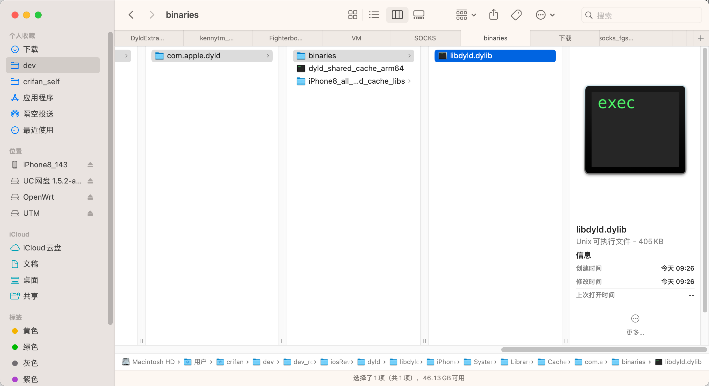

# 导出单个库

## 举例：`libdyld.dylib`

* 用法举例
  ```bash
  dyldex -e libdyld.dylib ./dyld_shared_cache_arm64
  ```
* 输出
  ```bash
  ➜  com.apple.dyld dyldex -e libdyld.dylib ./dyld_shared_cache_arm64
  Extracting /usr/lib/system/libdyld.dylib
  Extractor >> Done :: [/]
  ```
* 导出的文件：
  * `/usr/lib/system/libdyld.dylib`
    * 大小：`396KB` = Mac中占用空间：`405KB`
      * 
