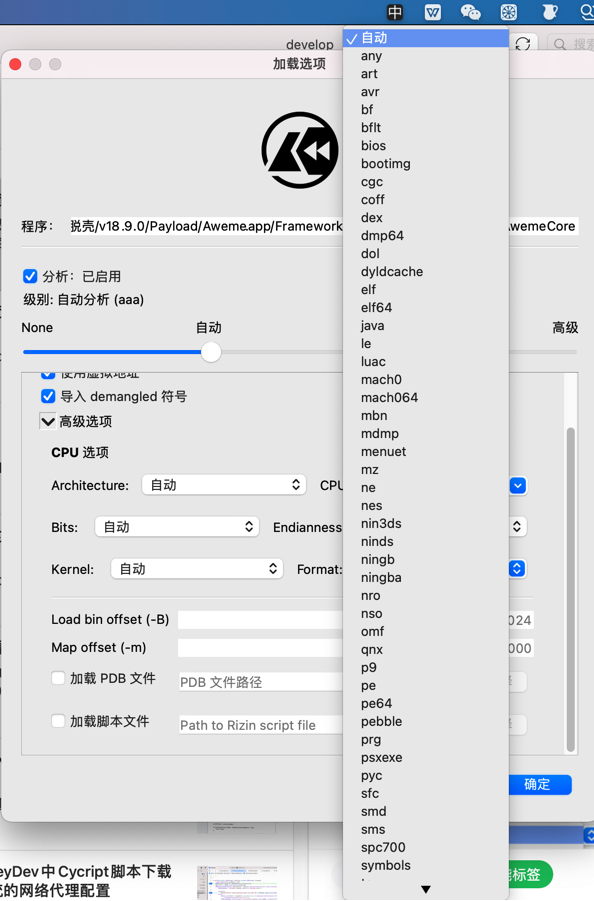

# 涉及的地方

## /System/Library/Caches/com.apple.dyld/dyld_shared_cache_armX

### iPhone7

```bash
iPhone7:~ root# ls -lh /System/Library/Caches/com.apple.dyld
total 1.7G
-rwxr-xr-x 1 root admin 1.7G Apr  3  2020 dyld_shared_cache_arm64*
```

### iPhone8

```bash
iPhone8-150:~ root# ls -lh /System/Library
total 0
...
drwxr-xr-x   40 root wheel 1.3K Sep 16  2021 CacheDelete/
drwxr-xr-x    6 root wheel  192 Sep 16  2021 Caches/
...
```

->

```bash
iPhone8-150:~ root# ls -lh /System/Library/Caches
total 0
lrwxr-xr-x  1 root wheel  45 Sep 16  2021 apticket.der -> ../../../usr/standalone/firmware/apticket.der
drwxr-xr-x  9 root wheel 288 Sep 16  2021 com.apple.dyld/
drwxr-xr-x 21 root wheel 672 Nov 11  2014 com.apple.factorydata/
drwxr-xr-x  2 root wheel  64 Sep 16  2021 com.apple.kernelcaches/
```

->

```bash
iPhone8-150:~ root# ls -lh /System/Library/Caches/com.apple.dyld
total 2.5G
-rwxr-xr-x 1 root admin 521M Sep 16  2021 dyld_shared_cache_arm64*
-rwxr-xr-x 1 root admin 513M Sep 16  2021 dyld_shared_cache_arm64.1*
-rwxr-xr-x 1 root admin 508M Sep 16  2021 dyld_shared_cache_arm64.2*
-rwxr-xr-x 1 root admin  83M Sep 16  2021 dyld_shared_cache_arm64.3*
-rwxr-xr-x 1 root admin 238M Sep 16  2021 dyld_shared_cache_arm64.4*
-rwxr-xr-x 1 root admin 199M Sep 16  2021 dyld_shared_cache_arm64.5*
-rwxr-xr-x 1 root admin 456M Sep 16  2021 dyld_shared_cache_arm64.symbols*
```

## /System/Library/dyld/dyld_shared_cache_arm64e

[How to Reverse Engineer an Undocumented macOS API to Use It in a Swift Project | Apriorit](https://www.apriorit.com/dev-blog/778-reverse-engineering-undocumented-macos-api)

Step 1: Obtaining a method signature

The OSSystemExtensionClient API is part of the SystemExtensions framework. The framework is packaged as a dynamically linked shared library, which is part of the dynamically linked shared library cache available at /System/Library/dyld/dyld_shared_cache_arm64e.

## objc-runtime-new.mm

[objc-runtime-new.mm (apple.com)](https://opensource.apple.com/source/objc4/objc4-750/runtime/objc-runtime-new.mm.auto.html)

```c
objc_class::demangledName(bool realize)
...
    // fixme lldb's calls to class_getName() can also get here when
    // interrogating the dyld shared cache. (rdar://27258517)
    // fixme runtimeLock.assertLocked();
    // fixme assert(realize);
```

## Mask.dylib

```bash
➜  DynamicLibraries rabin2 -i Mask.dylib > MaskDylib_rabin2_i_imports.txt
```

->

`MaskDylib_rabin2_i_imports.coffee`

```
50  0x0000e508 NONE FUNC           dyld_shared_cache_file_path
```

## IDA

[DYLD Shared Cache Utils | Hex-Rays Docs](https://docs.hex-rays.com/user-guide/plugins/plugins-shipped-with-ida/dyld-shared-cache-utils)

[IDA: IDA 7.2 - The Mac Rundown (hex-rays.com)](https://hex-rays.com/products/ida/news/7_2/the_mac_rundown/)

This is another annoyance of dyldcache analysis

## Cutter



中有：`dyldcache`

## jtool2

```bash
➜  jtool2 jtool2 --help
...
   -h             Dump Mach-O (or DYLD Shared Cache) header
...
   -e             extract fat slice, Mach-O segment/section, dyld shared cache dylib or (NEW) kernelcache kext
...
dyldinfo Compatible Options:
   --bind             print addresses dyld will set based on symbolic lookups
   --lazy_bind        print addresses dyld will lazily set on first use
   --opcodes          print opcodes used to generate the rebase and binding information
   --function_starts    print table of function start addresses
...
   --tbd          Create a .tbd file (for *OS private frameworks only - you'll need the dyld shared cache for this)
```
